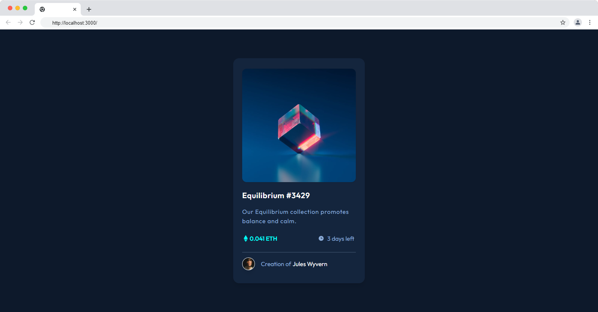

# Frontend Mentor - NFT preview card component solution



This is a solution to the [NFT preview card component challenge on Frontend Mentor](https://www.frontendmentor.io/challenges/nft-preview-card-component-SbdUL_w0U). Frontend Mentor challenges help you improve your coding skills by building realistic projects.

## Table of contents

- [Frontend Mentor - NFT preview card component solution](#frontend-mentor---nft-preview-card-component-solution)
  - [Table of contents](#table-of-contents)
  - [Overview](#overview)
    - [The challenge](#the-challenge)
  - [My process](#my-process)
    - [Built with](#built-with)
    - [What I learned](#what-i-learned)
  - [Author](#author)

## Overview

### The challenge

Users should be able to:

- View the optimal layout depending on their device's screen size
- See hover states for interactive elements

## My process

### Built with

- React js
- Vite
- Scss
- Tailwind
- Eslint
- Prettier

### What I learned

I've learned a lot of stuff about tailwind like using util classes inside css and scss files with @apply and also learned about using module style file in react

```css
.eth-icon {
  @apply flex items-center justify-center;
}
```

## Author

- Github - [Hesam-Init](https://github.com/hesam-init)
- Frontend Mentor - [@hesam-init](https://www.frontendmentor.io/profile/hesam-init)
